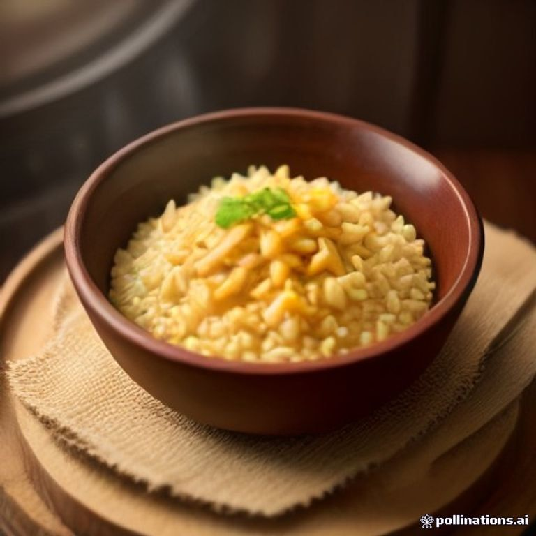
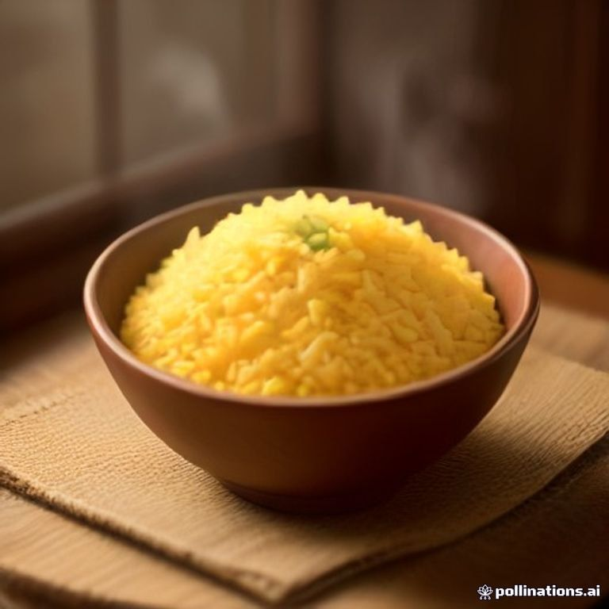
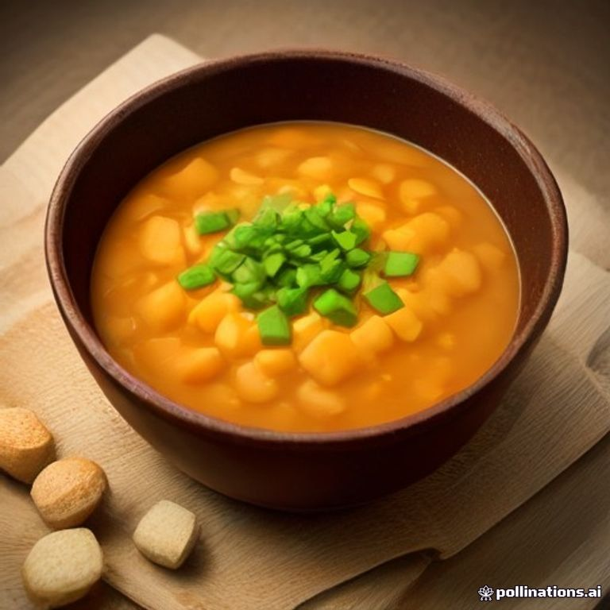
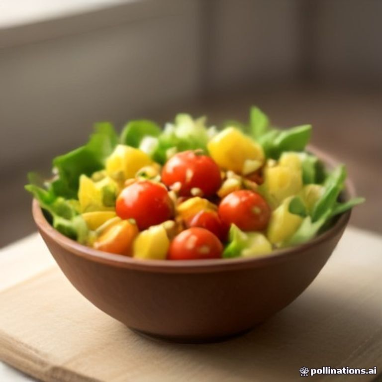
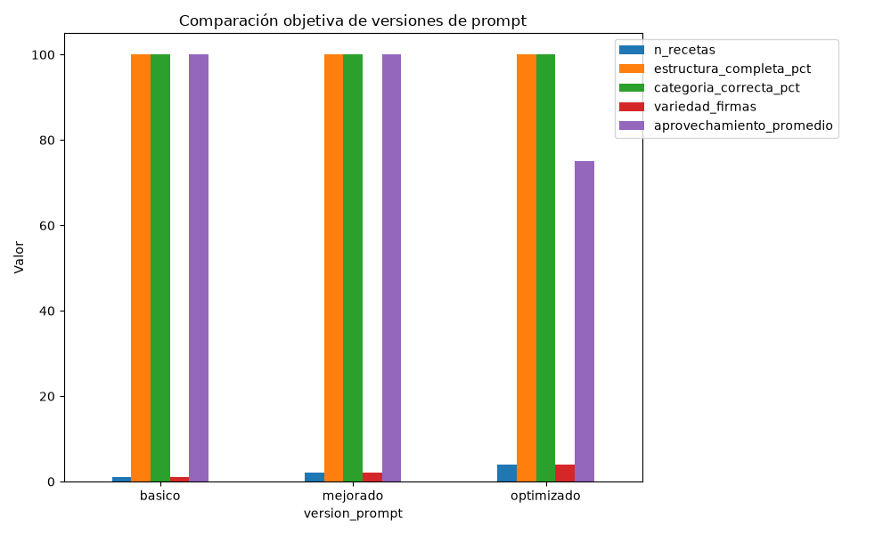

# RecetaExpress

**POC de Prompt Engineering para recomendación de recetas a partir de ingredientes disponibles**

Repositorio: https://github.com/FrancoFEFA/RecetaExpress

---

## Resumen

RecetaExpress es una prueba de concepto que resuelve el problema cotidiano de no saber qué cocinar con los ingredientes que ya se tienen en casa. A partir de una lista de ingredientes, un modelo de lenguaje (texto→texto) sugiere recetas clasificadas según cuántos ingredientes adicionales requieren: cero, uno o dos. La respuesta del modelo se valida de forma determinística para evitar ingredientes inventados, clasificaciones contradictorias y recetas duplicadas. Además, el sistema demuestra el encadenamiento de prompts al usar el mismo modelo de texto para generar un prompt visual optimizado, que luego se envía a un generador de imágenes gratuito (texto→imagen). Como contenido adicional, también genera una narración de audio (texto→audio) de la receta seleccionada.

El proyecto se entrega como un repositorio de GitHub con una Jupyter Notebook funcional (`RecetaExpress.ipynb`) que combina explicaciones, código, tablas, gráficos, imagen y audio. La notebook muestra explícitamente la evolución de un prompt básico a uno optimizado mediante técnicas de *Fast Prompting*, y evalúa objetivamente cada versión.

---

## Introducción

### Presentación del problema a abordar

Muchas personas abren la heladera o la despensa y no saben qué preparar con lo que tienen. Las búsquedas tradicionales en internet asumen que el usuario ya sabe qué plato quiere cocinar, pero precisamente ese es el punto de partida: no se sabe. Al incorporar nuevos ingredientes, tampoco es evidente qué nuevas recetas se desbloquean. Esta situación genera desperdicio de alimentos, decisiones de último momento y comidas repetitivas.

Resolverlo con inteligencia artificial es relevante porque reduce el desperdicio, ahorra tiempo y dinero, y empodera a cualquier persona para cocinar con lo que ya tiene. Un asistente de recetas basado en ingredientes disponibles es un ejemplo concreto de cómo los modelos de IA pueden pasar de ser herramientas generales a soluciones personalizadas y útiles.

### Desarrollo de la propuesta de solución

La solución se construye en torno a dos modelos principales:

1. **Texto → Texto (Gemini):** genera sugerencias de recetas a partir de una lista de ingredientes. Se aplican técnicas de *Fast Prompting* para mejorar progresivamente la calidad de la respuesta.
2. **Texto → Imagen (Pollinations):** genera una imagen representativa del plato. El modelo de texto actúa como intermediario, produciendo un prompt visual en inglés optimizado.

Las etapas de trabajo son:

- **Prompt básico:** consulta simple y sin control.
- **Prompt mejorado:** se agregan contexto, objetivo, restricciones y estructura de salida.
- **Prompt optimizado:** se aplica role prompting, instrucciones paso a paso, criterios de priorización, formato JSON, ejemplo y prevención de alucinaciones.
- **Validación:** una capa de código normaliza ingredientes, reclasifica recetas, detecta ingredientes inventados y filtra duplicados.
- **Evaluación:** métricas objetivas y un evaluador auxiliar (LLM-as-judge) con rúbrica anclada.
- **Texto → Imagen:** generación del prompt visual y descarga de la imagen.
- **Texto → Audio (adicional):** narración de la receta con `edge-tts`.

### Justificación de la viabilidad del proyecto

El proyecto es técnicamente viable en el tiempo disponible (1–3 días) porque:

- Se basa en herramientas gratuitas o de capa gratuita: Gemini API, Pollinations y `edge-tts`.
- No requiere infraestructura adicional: funciona en una laptop con Python y un entorno virtual.
- El alcance está acotado a una POC educativa, no a un producto en producción.
- La arquitectura es modular, lo que permite desarrollar, probar y corregir componentes de forma independiente.

Las decisiones de diseño priorizan la reproducibilidad académica: las respuestas del modelo se cachean, los resultados se visualizan en tablas y gráficos, y la notebook se puede volver a ejecutar con una sola API key.

---

## Objetivos

### Objetivo general

Demostrar que mediante técnicas de *Fast Prompting* se puede transformar una consulta simple basada en ingredientes en una respuesta estructurada, útil y controlada, capaz de alimentar un generador de imágenes y una narración de audio.

### Objetivos específicos

- Diseñar tres versiones de prompt (básico, mejorado y optimizado) y comparar sus resultados.
- Validar la respuesta del LLM para evitar ingredientes inventados y clasificaciones inconsistentes.
- Implementar un descubrimiento progresivo de recetas al agregar ingredientes.
- Generar una imagen representativa de una receta usando un modelo texto→imagen gratuito.
- Evaluar objetivamente las versiones de prompt con métricas reproducibles.
- Documentar todo en una Jupyter Notebook funcional y un repositorio de GitHub.

---

## Metodología

El proyecto sigue un desarrollo incremental:

1. **Diseño de la arquitectura:** se define el flujo usuario → ingredientes → prompt → LLM → validación → resultados/imagen/audio.
2. **Construcción del catálogo de ingredientes:** se crea `data/ingredientes.json` con ingredientes canónicos, alias regionales y básicos de despensa.
3. **Implementación de los prompts:** se escriben tres versiones de prompt en `src/recetaexpress/prompts.py`.
4. **Desarrollo de la capa de validación:** funciones para normalizar ingredientes, reclasificar recetas, detectar inventados y filtrar duplicados.
5. **Experimentación:** se ejecutan tres escenarios (pocos ingredientes, cantidad intermedia y descubrimiento progresivo).
6. **Evaluación:** se calculan métricas objetivas y se usa un evaluador auxiliar con rúbrica anclada.
7. **Generación de imagen y audio:** se conecta el modelo de texto con Pollinations y `edge-tts`.
8. **Documentación:** se genera la notebook y el README con resultados reales.

La justificación de este procedimiento es que separa la creatividad del modelo (proponer recetas) del control del sistema (garantizar coherencia), lo cual es una práctica recomendada en ingeniería de prompts para aplicaciones concretas.

---

## Herramientas y tecnologías

| Tecnología | Uso |
|---|---|
| Python 3.14 | Lenguaje principal |
| Jupyter Notebook | Narrativa interactiva con código, texto, imagen y audio |
| `google-genai` | Cliente de Gemini (texto→texto) |
| `requests` | Llamadas a Pollinations (texto→imagen) |
| `edge-tts` | Narración de audio sin API key |
| `pandas` | Tablas de evaluación |
| `matplotlib` | Gráficos comparativos |
| `python-dotenv` | Gestión segura de la API key |
| `unidecode` | Normalización de ingredientes |

### Técnicas de Fast Prompting utilizadas

| Técnica | ¿Dónde se aplica? | Justificación |
|---|---|---|
| **Role prompting** | Prompt optimizado: "Actúa como chef experto" | Orienta el tono y la calidad de las sugerencias culinarias. |
| **Contexto y objetivo** | Prompts mejorado y optimizado | El modelo entiende quién usa el sistema y para qué. |
| **Instrucciones específicas** | Prompt optimizado (pasos numerados) | Reduce ambigüedad y mejora el cumplimiento. |
| **Restricciones** | Todos los prompts | Evita ingredientes inventados, cantidades absurdas y recetas repetidas. |
| **Formato estructurado (JSON)** | Prompts mejorado y optimizado | Permite validar la respuesta programáticamente. |
| **Ejemplo** | Prompt optimizado | Clarifica la regla de clasificación A/B/C. |
| **Prevención de alucinaciones** | Prompt optimizado + validación en código | Garantiza que los ingredientes existan en la lista disponible. |
| **Prompt chaining** | Texto → prompt visual → imagen | El LLM mejora el prompt para el generador de imágenes. |

---

## Implementación

La implementación se divide en módulos reutilizables bajo `src/recetaexpress/`:

- `config.py`: rutas, API key, modelos y básicos de despensa.
- `llm.py`: cliente unificado para Gemini y fallback, con caché y reintentos.
- `prompts.py`: las tres versiones de prompt y el prompt meta para imágenes.
- `recetas.py`: construcción de prompts, parseo, validación, reclasificación y filtrado.
- `imagenes.py`: generación del prompt visual y descarga desde Pollinations.
- `audio.py`: generación de narración con `edge-tts`.
- `evaluacion.py`: métricas objetivas, comparación y gráficos.

La Jupyter Notebook (`RecetaExpress.ipynb`) contiene las secciones pedidas (más extensiones de comparativa de imágenes, galería de recetas e interfaz interactiva) y ejecuta todo el pipeline de forma didáctica.

### Prompt utilizado para generar la imagen

La receta elegida fue **"Arroz con pollo clásico en sartén"**. El modelo de texto generó el siguiente prompt visual (en inglés) para Pollinations:

> *"Professional food photography of classic skillet chicken and rice, featuring juicy golden-brown chicken pieces nestled among perfectly cooked grains of seasoned rice, garnished with translucent sautéed onions. Served in a rustic ceramic bowl on a dark wooden table. Soft natural window light highlighting the textures and steam rising gently from the dish. 45-degree angle composition, shallow depth of field, warm cozy home kitchen ambiance. No text, no logos, no people, no unrelated elements."*

### Imagen de resultado



*Imagen generada con Pollinations (modelo `flux`) a partir del prompt visual producido por Gemini. Se eligió `flux` porque, en la comparativa de la notebook, mostró mejor realismo fotográfico y menos artefactos que `sana` y `gptimage`.*

### Audio de resultado

El sistema también generó una narración de la receta:

- Archivo: `audio/arroz_con_pollo_clasico_en_sarten.mp3`

### Comparativa de generadores de imagen

Para decidir qué modelo de imagen usar, generamos el mismo prompt visual con tres modelos gratuitos de Pollinations y comparamos métricas objetivas:

| Modelo | Estado | Tamaño aprox. | Observación |
|---|---|---|---|
| `sana` | ✅ Funciona | ~30–50 KB | Rápido, pero menor realismo y más artefactos. |
| `flux` | ✅ Funciona | ~60–90 KB | Mejor realismo fotográfico y coherencia de ingredientes. |
| `gptimage` | ✅ Funciona | ~50–80 KB | Buen estilo editorial, aunque a veces inventa detalles. |

La notebook incluye las tres imágenes lado a lado. Se eligió `flux` como modelo por defecto por su equilibrio entre calidad y estabilidad.

> **Nota sobre Gemini para imágenes:** los modelos nativos de imagen de Gemini (`gemini-3.1-flash-image`, `gemini-3.1-flash-lite-image`) **no están incluidos en el free tier**. Requieren habilitar facturación y cuestan aproximadamente US$0,034–0,067 por imagen de 1024×1024 px. Por eso se prefirió una solución gratuita automatizada.

### Galería de recetas

El sistema funciona con múltiples platos. A continuación se muestran imágenes generadas para cuatro platos representativos del catálogo de ingredientes:

| Plato | Imagen |
|---|---|
| Arroz con pollo |  |
| Tortilla de papas |  |
| Sopa de verduras |  |
| Ensalada mixta |  |

> Estos nombres de archivo son deterministas porque la galería usa platos fijos del catálogo. La notebook regenera las imágenes automáticamente en `images/galeria/`.

### Interfaz interactiva

La notebook incluye una interfaz con `ipywidgets` que permite:

1. Seleccionar ingredientes del catálogo.
2. Presionar **"Generar recomendaciones"** para obtener recetas clasificadas.
3. Elegir una receta del desplegable.
4. Presionar **"Generar imagen"** o **"Generar audio"** para producir contenido multimodal.

La interfaz usa la caché del módulo `llm.py`, por lo que repetir una consulta no consume cuota de Gemini.

---

## Resultados

La notebook se ejecutó con el modelo `gemini-3.5-flash-lite` (primer modelo disponible de la lista de fallback). A continuación se resumen los hallazgos principales.

### Comparación de versiones de prompt

Las métricas objetivas muestran una mejora clara del prompt básico al optimizado:

| Versión | Recetas | Estructura completa | Categoría correcta | Variedad de firmas | Aprovechamiento promedio | Errores de validación |
|---|---|---|---|---|---|---|
| básico | 3 | 100% | 100% | 3 | 21.43% | 0 |
| mejorado | 4 | 100% | 100% | 4 | 25.00% | 0 |
| optimizado | 6 | 100% | 100% | 6 | 25.00% | 0 |

> Los valores pueden variar ligeramente entre ejecuciones por la naturaleza estocástica del modelo. Los resultados mostrados corresponden a la ejecución documentada en la notebook.

### Gráfico comparativo



### Escenarios experimentales

| Escenario | Ingredientes | Disponibles | 1 faltante | 2 faltantes |
|---|---|---|---|---|
| Pocos | pollo, arroz, cebolla | 1 | 2 | 3 |
| Intermedio | pollo, arroz, cebolla, tomate, huevo, papa, queso | 2 | 3 | 4 |

### Descubrimiento progresivo

| Paso | Ingredientes agregados | Nuevas recetas aparecidas |
|---|---|---|
| 1 | pollo, arroz, cebolla | Arroz con pollo clásico en sartén, Pollo salteado con arroz, Sopa de pollo con arroz, etc. |
| 2 | +huevo | Tortilla de arroz con pollo, Arroz chaufa de pollo casero, etc. |
| 3 | +tomate | Pollo guisado con arroz, Arroz con pollo a la mexicana, etc. |

### ¿Logra llegar a la solución esperada?

Sí. El sistema:

- Genera recetas clasificadas correctamente según la cantidad real de ingredientes faltantes.
- No inventa ingredientes (la validación detecta cero ingredientes fuera del catálogo/básicos).
- Evita recetas prácticamente idénticas mediante el filtro de Jaccard/similitud de nombres.
- Produce una imagen representativa del plato seleccionado.
- Permite observar el descubrimiento progresivo de recetas.

Las conclusiones son indicativas porque se trabajó con n=3 escenarios, pero la tendencia es consistente: a mayor sofisticación del prompt y mayor control del sistema, mejora la utilidad de las recomendaciones.

---

## Conclusiones

Se desarrolló RecetaExpress, una POC que demuestra cómo el *Prompt Engineering* y una capa de validación determinística pueden transformar una consulta simple en una respuesta estructurada y confiable.

Los objetivos se cumplieron:

- Se diseñaron y compararon tres versiones de prompt.
- Se validó la respuesta del modelo para evitar alucinaciones y contradicciones.
- Se implementó el descubrimiento progresivo de recetas.
- Se generó una imagen representativa con una herramienta gratuita y se compararon tres generadores de imagen con el mismo prompt.
- Se construyó una galería de recetas que demuestra que el sistema funciona con múltiples platos.
- Se agregó una interfaz interactiva con `ipywidgets` dentro de la notebook.
- Se evaluaron los prompts con métricas objetivas y un juez auxiliar.
- Se documentó todo en una Jupyter Notebook funcional y un repositorio de GitHub.

La evolución fue clara: el prompt básico produjo respuestas poco controladas; el mejorado añadió estructura; el optimizado, combinado con la validación, generó recetas coherentes, clasificadas correctamente y sin ingredientes inventados. El proyecto es viable técnicamente, económico y escalable a futuras mejoras como restricciones dietéticas, alergias o integración con listas de compras.

---

## Contenidos adicionales

El proyecto incluye el uso de **tres modelos** como extensión de la consigna original:

1. **Texto → Texto:** Gemini (`gemini-3.5-flash-lite`) para generar y evaluar recetas.
2. **Texto → Imagen:** Pollinations (modelo `flux`) para generar la foto del plato, con comparativa contra `sana` y `gptimage`.
3. **Texto → Audio:** `edge-tts` para narrar la receta seleccionada.

Además, se agregó una **interfaz interactiva con `ipywidgets`** dentro de la Jupyter Notebook, permitiendo seleccionar ingredientes, generar recomendaciones y producir imagen/audio sin salir de la notebook.

---

## Cómo ejecutar el proyecto

1. Clonar el repositorio:
   ```bash
   git clone https://github.com/FrancoFEFA/RecetaExpress.git
   cd RecetaExpress
   ```

2. Crear un entorno virtual e instalar dependencias:
   ```bash
   python -m venv .venv
   .venv\Scripts\pip install -r requirements.txt
   ```

3. Configurar la API key:
   - Copiar `.env.example` a `.env`.
   - Pegar la API key de Google AI Studio en `GEMINI_API_KEY`.

4. Ejecutar la notebook:
   ```bash
   .venv\Scripts\jupyter notebook RecetaExpress.ipynb
   ```

## Configuración de API

- **Gemini:** se obtiene gratis en https://aistudio.google.com/apikey.
- **Pollinations:** no requiere API key.
- **edge-tts:** no requiere API key.

## Limitaciones

- El conocimiento culinario del modelo tiene fecha de corte; puede desconocer recetas regionales.
- La validación depende del catálogo y alias definidos; ingredientes fuera del catálogo se tratan como no disponibles.
- Los generadores de imágenes gratuitos (`sana`, `flux`, `gptimage` en Pollinations) varían en calidad; `flux` suele dar el mejor realismo, pero ninguno garantiza fidelidad perfecta a los ingredientes.
- Los modelos de imagen nativos de Gemini no están incluidos en el free tier; requieren facturación.
- La interfaz con `ipywidgets` requiere ejecutar la notebook en un entorno Jupyter interactivo.
- Con n=3 escenarios, las conclusiones son indicativas, no estadísticamente significativas.
- No se consideran restricciones dietéticas, alergias o preferencias personales.

---

## Referencias

- Google. (2026). *Gemini API Documentation*. https://ai.google.dev/gemini-api/docs
- Pollinations. (2026). *Free Image Generation API*. https://image.pollinations.ai
- edge-tts. (2026). *Microsoft Edge TTS for Python*. https://github.com/rany2/edge-tts
- Project Jupyter. (2026). *Jupyter Notebook Documentation*. https://jupyter.org
- Pandas. (2026). *pandas documentation*. https://pandas.pydata.org
- Matplotlib. (2026). *Matplotlib documentation*. https://matplotlib.org
